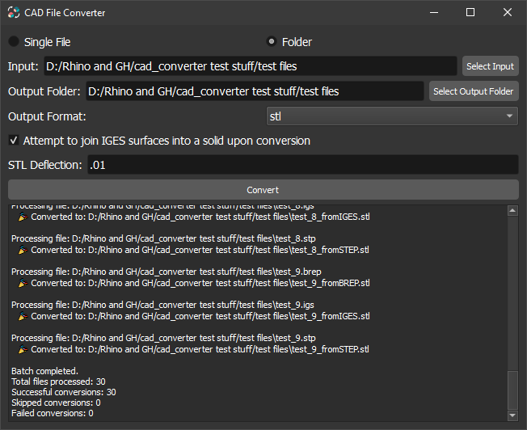

# PythonOCC-CAD-Converter

🚀 **A modern, easy-to-use CAD file converter built with PythonOCC and PyQt5.**  
Convert **STEP, IGES, BREP, and STL** files seamlessly with a **batch mode** and a sleek GUI.

  

---

## 🎯 **Features**
✅ Convert between **STEP, IGES, BREP, and STL**  
✅ **Batch conversion** - Convert an entire folder at once  
✅ **Sleek & modern GUI** with dark mode  
✅ **STL Export** - Customize mesh resolution  
✅ **IGES Surface Sewing** - Optionally join IGES surfaces into solids  
✅ **Fully standalone** - No external CAD software required  

---

## 📥 **Download & Install**
🔹 **Windows Users:**  
- **Download the latest `.exe` file** from [GitHub Releases](https://github.com/DalessandroJ/PythonOCC-CAD-Converter/releases).
- **Run** the `.exe` - No installation needed!  

🔹 **Mac & Linux Users:**  
- Currently, **only Windows builds** are available.  
- To run from source, follow the [Build from Source](#-build-from-source) guide.

---

## 🚀 **How to Use**
### 🔹 **Graphical Interface (Recommended)**
1. **Run the application** (`gui.exe` on Windows).
2. **Select a CAD file or folder** to convert.
3. **Choose an output format** (`STEP`, `IGES`, `BREP`, or `STL`).
4. **Set any additional options** (e.g., IGES sewing, STL resolution).
5. **Click "Convert"** and watch it go! 🎉

### 🔹 **Command Line Mode**
You can also run the converter from the terminal:
```bash
python main.py
```
It will guide you through the process interactively.

---

## 🏗️ **Build from Source**
If you prefer to run this project from source (or you're on Mac/Linux), follow these steps:

### **🔹 Prerequisites**
- **Python 3.9+**
- **Git**
- **Conda (recommended)**
- **PyQt5 & PythonOCC**

### **🔹 Setup & Installation**
1. **Clone the repository**:
   ```bash
   git clone https://github.com/DalessandroJ/PythonOCC-CAD-Converter.git
   cd PythonOCC-CAD-Converter
   ```

2. **Create & activate a Conda environment**:
   ```bash
   conda create --name cad_env python=3.9 -y
   conda activate cad_env
   ```

3. **Install dependencies**:
   ```bash
   conda install -c conda-forge pythonocc-core pyqt
   ```

4. **Run the GUI**:
   ```bash
   python gui.py
   ```

---

## 🎁 **Build & Package Your Own Executable**
If you want to package this into an `.exe` or standalone application:
```bash
pyinstaller --onefile --windowed --add-data "resources/icon.png;resources" gui.py
```
On **Mac/Linux**, use `:` instead of `;`:
```bash
pyinstaller --onefile --windowed --add-data "resources/icon.png:resources" gui.py
```
Your executable will be in the `dist/` folder.


---

## 👥 **Contributing**
Feel free to submit **issues, feature requests, or pull requests** on GitHub!  
Clone, modify, and improve it however you like.  

---

## ⚖️ **License**
📜 **MIT License** - Free to use, modify, and share.  
*No warranties. Use at your own risk.*

---

## ❤️ **Support & Feedback**
⭐ **If you like this project, consider starring it on GitHub!**  
🐛 Found a bug? **Report it [here](https://github.com/DalessandroJ/PythonOCC-CAD-Converter/issues).**  

🚀 **Enjoy converting your CAD files effortlessly!**
